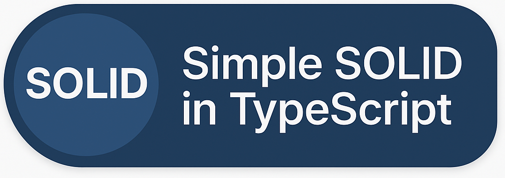

# Simple SOLID in TypeScript

This repository contains clear and practical examples of the **SOLID principles** implemented in **TypeScript**.

Each principle includes:
- ❌ An incorrect implementation (violating the principle)
- ✅ A corrected version (applying the principle)

The goal is to help developers understand **clean architecture** and **object-oriented design** in a simple, hands-on way.

---

## What are the SOLID Principles?

**SOLID** is an acronym for five fundamental principles of object-oriented programming that promote better software design:

| Principle | Meaning |
|----------|---------|
| **S** | **Single Responsibility Principle (SRP)** – A class should have one, and only one, reason to change. |
| **O** | **Open/Closed Principle (OCP)** – Software should be open for extension, but closed for modification. |
| **L** | **Liskov Substitution Principle (LSP)** – Subtypes must be substitutable for their base types. |
| **I** | **Interface Segregation Principle (ISP)** – Clients shouldn't be forced to depend on methods they don’t use. |
| **D** | **Dependency Inversion Principle (DIP)** – High-level modules shouldn't depend on low-level modules, but on abstractions. |

---

## Examples

Each principle has its own file with before/after code examples.

### 1. Single Responsibility Principle (SRP)
File: `01-single-responsability-principle.ts`

- ❌ `UserController` handles too many responsibilities
- ✅ Separated into `UserService`, `UserNotificationService`, and `UserController`

---

### 2. Open/Closed Principle (OCP)
File: `02-open-close-principle.ts`

- ❌ Modifying a `PaymentService` to support new payment types
- ✅ Using interfaces for easy extensibility without changing existing code

---

### 3. Liskov Substitution Principle (LSP)
File: `03-liskov-substitution-principle.ts`

- ❌ A child class (`SoldProperty`) breaks the behavior of its parent
- ✅ Refactored using clear interfaces for safer substitutions

---

### 4. Interface Segregation Principle (ISP)
File: `04-interface-segregation-principle.ts`

- ❌ A large interface forces unnecessary implementations
- ✅ Smaller interfaces (`BasicProperty`, `Reformable`) for more control

---

### 5. Dependency Inversion Principle (DIP)
File: `05-dependency-inversion-principle.ts`

- ❌ High-level `InvestorNotifier` depends directly on `SendGridClient`
- ✅ Introduced `EmailService` interface to decouple layers

---

## Contributing

Contributions are welcome! If you want to:
- Add more real-world examples
- Improve explanations
- Translate to another language

Feel free to open an issue or pull request 
